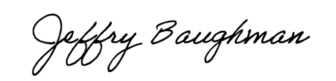

# VA Medical Evidence Packet Builder
**A simple tool for office workers to automatically generate medical research packets.**

This tool does all the heavy lifting for you. You give it a Veteran's Memorandum, and it automatically reads their name, SSN, and medical conditions. It then downloads the required medical research and stitches it together into a single, clean PDF that is ready to submit.

---

## 🚀 Step 1: How to Start the App

You do not need to know any code to run this. Just follow these steps:

1. **Download this Tool:** Click the green **"Code"** button at the top right of this GitHub page, and select **"Download ZIP"**.
2. **Unzip it:** Extract the folder to somewhere you can easily find it, like your Desktop.
3. **Run It:**
   * **If you are on Windows:** Double-click the file named `run_windows.bat`. 
   * **If you are on Mac/Linux:** Double-click the file named `run_mac_linux.sh` (or open a terminal in that folder and type `sh run_mac_linux.sh`).
4. **Wait a moment:** A black box (terminal) will pop up. **On the very first run**, it will automatically download its own private copy of the Node.js engine and the Google Chrome background worker. (It might take 1-2 minutes).
5. **Open the Website:** Your web browser will automatically open to `http://localhost:5000`. This is your private, secure, local workspace!

*(Note: Keep the black terminal box open while you are using the app. When you are done for the day, just close the black box to turn the app off).*

---

## 📖 Step 2: How to Use the App

1. **Upload Documents:** Drag and drop your blank Evidence Summary Form (ESF) into the first box. Drag the Veteran's Memorandum into the second box.
2. **Review the Data:** The app will automatically read the memorandum. It will show you the Veteran's Name, SSN, and the medical conditions it found. Make sure they are correct.
3. **Add Links:** For each condition, paste the URL link to the medical research (like a PubMed article). 
4. **Generate:** Click the big "Generate Packets" button.
5. **Security Checks (CAPTCHAs):** If a website thinks you are a robot and throws up a "Verify you are human" check, a Chrome window will pop up. Just click the checkbox in that window to prove you are human, and then click the green **"I Have Solved the CAPTCHA"** button in our app to continue!
6. **Download:** When it finishes, click the Download button next to each condition to get your fully-stamped, compressed PDF packet.

---

## ✍️ How to Add a Digital Signature (Optional)

You can have the app automatically stamp your digital signature into **Box 19A** on the generated Evidence Summary Form!

To set this up, you need a clean, transparent image of your signature. Here is how to make one:

1. **Get your Signature:** Take a clear photo of your signature, or write it in a drawing app. Make sure it is straight (not rotated).
2. **Crop It:** Crop the image so that the edges of the picture are closely wrapped around your signature, like this:

   

3. **Remove the Background:** A solid white background can accidentally cover up the black lines of the PDF box. Go to [remove.bg](https://www.remove.bg/) and upload your cropped signature. It will automatically strip away the white background for free!
4. **Download and Upload:** Download the new transparent image (it will be a `.png` file). Drag and drop this `.png` file into the 3rd **"Signature Image"** box in the app.

*Note: The app's Job History feature will automatically remember your signature when you click "Reload Job" for past clients!*
